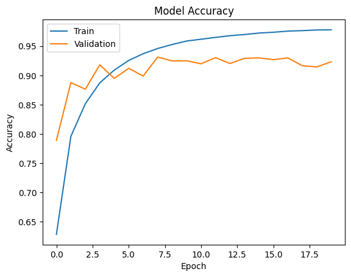
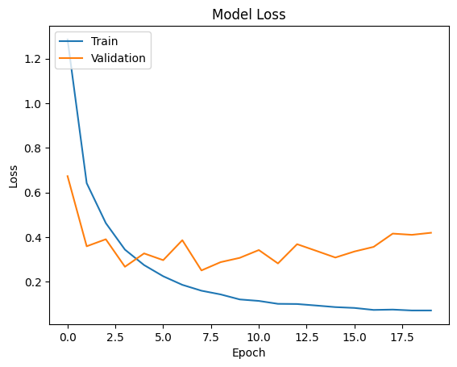

```python
!pip uninstall -y torch torchvision torchaudio
!pip install --index-url https://download.pytorch.org/whl/cu121 torch torchvision torchaudio
```

    Found existing installation: torch 2.1.0+cu118
    Uninstalling torch-2.1.0+cu118:
      Successfully uninstalled torch-2.1.0+cu118
    Found existing installation: torchvision 0.16.0+cu118
    Uninstalling torchvision-0.16.0+cu118:
      Successfully uninstalled torchvision-0.16.0+cu118
    Found existing installation: torchaudio 2.1.0+cu118
    Uninstalling torchaudio-2.1.0+cu118:
      Successfully uninstalled torchaudio-2.1.0+cu118
    Looking in indexes: https://download.pytorch.org/whl/cu121
    Collecting torch
      Using cached https://download-r2.pytorch.org/whl/cu121/torch-2.5.1%2Bcu121-cp310-cp310-win_amd64.whl (2449.4 MB)
    Collecting torchvision
      Using cached https://download-r2.pytorch.org/whl/cu121/torchvision-0.20.1%2Bcu121-cp310-cp310-win_amd64.whl (6.1 MB)
    Collecting torchaudio
      Using cached https://download-r2.pytorch.org/whl/cu121/torchaudio-2.5.1%2Bcu121-cp310-cp310-win_amd64.whl (4.1 MB)
    Requirement already satisfied: filelock in c:\users\amans\anaconda3\envs\plant-disease\lib\site-packages (from torch) (3.25.2)
    Requirement already satisfied: typing-extensions>=4.8.0 in c:\users\amans\anaconda3\envs\plant-disease\lib\site-packages (from torch) (4.15.0)
    Requirement already satisfied: networkx in c:\users\amans\anaconda3\envs\plant-disease\lib\site-packages (from torch) (3.4.2)
    Requirement already satisfied: jinja2 in c:\users\amans\anaconda3\envs\plant-disease\lib\site-packages (from torch) (3.1.6)
    Requirement already satisfied: fsspec in c:\users\amans\anaconda3\envs\plant-disease\lib\site-packages (from torch) (2026.3.0)
    Requirement already satisfied: sympy==1.13.1 in c:\users\amans\anaconda3\envs\plant-disease\lib\site-packages (from torch) (1.13.1)
    Requirement already satisfied: mpmath<1.4,>=1.1.0 in c:\users\amans\anaconda3\envs\plant-disease\lib\site-packages (from sympy==1.13.1->torch) (1.3.0)
    Requirement already satisfied: numpy in c:\users\amans\anaconda3\envs\plant-disease\lib\site-packages (from torchvision) (2.2.6)
    Requirement already satisfied: pillow!=8.3.*,>=5.3.0 in c:\users\amans\anaconda3\envs\plant-disease\lib\site-packages (from torchvision) (12.2.0)
    Requirement already satisfied: MarkupSafe>=2.0 in c:\users\amans\anaconda3\envs\plant-disease\lib\site-packages (from jinja2->torch) (3.0.3)
    Installing collected packages: torch, torchvision, torchaudio
    
       ---------------------------------------- 0/3 [torch]
       ---------------------------------------- 0/3 [torch]
       ---------------------------------------- 0/3 [torch]
       ---------------------------------------- 0/3 [torch]
       ---------------------------------------- 0/3 [torch]
       ---------------------------------------- 0/3 [torch]
       ---------------------------------------- 0/3 [torch]
       ---------------------------------------- 0/3 [torch]
       ---------------------------------------- 0/3 [torch]
       ---------------------------------------- 0/3 [torch]
       ---------------------------------------- 0/3 [torch]
       ---------------------------------------- 0/3 [torch]
       ---------------------------------------- 0/3 [torch]
       ---------------------------------------- 0/3 [torch]
       ---------------------------------------- 0/3 [torch]
       ---------------------------------------- 0/3 [torch]
       ---------------------------------------- 0/3 [torch]
       ---------------------------------------- 0/3 [torch]
       ---------------------------------------- 0/3 [torch]
       ---------------------------------------- 0/3 [torch]
       ---------------------------------------- 0/3 [torch]
       ---------------------------------------- 0/3 [torch]
       ---------------------------------------- 0/3 [torch]
       ---------------------------------------- 0/3 [torch]
       ---------------------------------------- 0/3 [torch]
       ---------------------------------------- 0/3 [torch]
       ---------------------------------------- 0/3 [torch]
       ---------------------------------------- 0/3 [torch]
       ---------------------------------------- 0/3 [torch]
       ---------------------------------------- 0/3 [torch]
       ---------------------------------------- 0/3 [torch]
       ---------------------------------------- 0/3 [torch]
       ---------------------------------------- 0/3 [torch]
       ---------------------------------------- 0/3 [torch]
       ---------------------------------------- 0/3 [torch]
       ---------------------------------------- 0/3 [torch]
       ---------------------------------------- 0/3 [torch]
       ---------------------------------------- 0/3 [torch]
       ---------------------------------------- 0/3 [torch]
       ---------------------------------------- 0/3 [torch]
       ---------------------------------------- 0/3 [torch]
       ---------------------------------------- 0/3 [torch]
       ---------------------------------------- 0/3 [torch]
       ---------------------------------------- 0/3 [torch]
       ---------------------------------------- 0/3 [torch]
       ---------------------------------------- 0/3 [torch]
       ---------------------------------------- 0/3 [torch]
       ---------------------------------------- 0/3 [torch]
       ---------------------------------------- 0/3 [torch]
       ---------------------------------------- 0/3 [torch]
       ---------------------------------------- 0/3 [torch]
       ---------------------------------------- 0/3 [torch]
       ---------------------------------------- 0/3 [torch]
       ---------------------------------------- 0/3 [torch]
       ---------------------------------------- 0/3 [torch]
       ---------------------------------------- 0/3 [torch]
       ---------------------------------------- 0/3 [torch]
       ---------------------------------------- 0/3 [torch]
       ---------------------------------------- 0/3 [torch]
       ---------------------------------------- 0/3 [torch]
       ---------------------------------------- 0/3 [torch]
       ---------------------------------------- 0/3 [torch]
       ---------------------------------------- 0/3 [torch]
       ---------------------------------------- 0/3 [torch]
       ---------------------------------------- 0/3 [torch]
       ---------------------------------------- 0/3 [torch]
       ---------------------------------------- 0/3 [torch]
       ---------------------------------------- 0/3 [torch]
       ---------------------------------------- 0/3 [torch]
       ---------------------------------------- 0/3 [torch]
       ---------------------------------------- 0/3 [torch]
       ---------------------------------------- 0/3 [torch]
       ---------------------------------------- 0/3 [torch]
       ---------------------------------------- 0/3 [torch]
       ---------------------------------------- 0/3 [torch]
       ---------------------------------------- 0/3 [torch]
       ---------------------------------------- 0/3 [torch]
       ---------------------------------------- 0/3 [torch]
       ---------------------------------------- 0/3 [torch]
       ---------------------------------------- 0/3 [torch]
       ---------------------------------------- 0/3 [torch]
       ---------------------------------------- 0/3 [torch]
       ---------------------------------------- 0/3 [torch]
       ---------------------------------------- 0/3 [torch]
       ---------------------------------------- 0/3 [torch]
       ---------------------------------------- 0/3 [torch]
       ---------------------------------------- 0/3 [torch]
       ---------------------------------------- 0/3 [torch]
       ---------------------------------------- 0/3 [torch]
       ---------------------------------------- 0/3 [torch]
       ---------------------------------------- 0/3 [torch]
       ---------------------------------------- 0/3 [torch]
       ---------------------------------------- 0/3 [torch]
       ---------------------------------------- 0/3 [torch]
       ---------------------------------------- 0/3 [torch]
       ---------------------------------------- 0/3 [torch]
       ---------------------------------------- 0/3 [torch]
       ---------------------------------------- 0/3 [torch]
       ---------------------------------------- 0/3 [torch]
       ---------------------------------------- 0/3 [torch]
       ---------------------------------------- 0/3 [torch]
       ---------------------------------------- 0/3 [torch]
       ---------------------------------------- 0/3 [torch]
       ---------------------------------------- 0/3 [torch]
       ---------------------------------------- 0/3 [torch]
       ---------------------------------------- 0/3 [torch]
       ---------------------------------------- 0/3 [torch]
       ---------------------------------------- 0/3 [torch]
       ---------------------------------------- 0/3 [torch]
       ---------------------------------------- 0/3 [torch]
       ---------------------------------------- 0/3 [torch]
       ---------------------------------------- 0/3 [torch]
       ---------------------------------------- 0/3 [torch]
       ---------------------------------------- 0/3 [torch]
       ---------------------------------------- 0/3 [torch]
       ---------------------------------------- 0/3 [torch]
       ---------------------------------------- 0/3 [torch]
       ---------------------------------------- 0/3 [torch]
       ---------------------------------------- 0/3 [torch]
       ---------------------------------------- 0/3 [torch]
       ---------------------------------------- 0/3 [torch]
       ---------------------------------------- 0/3 [torch]
       ---------------------------------------- 0/3 [torch]
       ---------------------------------------- 0/3 [torch]
       ---------------------------------------- 0/3 [torch]
       ---------------------------------------- 0/3 [torch]
       ---------------------------------------- 0/3 [torch]
       ---------------------------------------- 0/3 [torch]
       ---------------------------------------- 0/3 [torch]
       ---------------------------------------- 0/3 [torch]
       ---------------------------------------- 0/3 [torch]
       ---------------------------------------- 0/3 [torch]
       ---------------------------------------- 0/3 [torch]
       ---------------------------------------- 0/3 [torch]
       ---------------------------------------- 0/3 [torch]
       ---------------------------------------- 0/3 [torch]
       ---------------------------------------- 0/3 [torch]
       ---------------------------------------- 0/3 [torch]
       ---------------------------------------- 0/3 [torch]
       ---------------------------------------- 0/3 [torch]
       ---------------------------------------- 0/3 [torch]
       ---------------------------------------- 0/3 [torch]
       ---------------------------------------- 0/3 [torch]
       ---------------------------------------- 0/3 [torch]
       ---------------------------------------- 0/3 [torch]
       ---------------------------------------- 0/3 [torch]
       ---------------------------------------- 0/3 [torch]
       ---------------------------------------- 0/3 [torch]
       ---------------------------------------- 0/3 [torch]
       ---------------------------------------- 0/3 [torch]
       ---------------------------------------- 0/3 [torch]
       ---------------------------------------- 0/3 [torch]
       ---------------------------------------- 0/3 [torch]
       ---------------------------------------- 0/3 [torch]
       ---------------------------------------- 0/3 [torch]
       ---------------------------------------- 0/3 [torch]
       ---------------------------------------- 0/3 [torch]
       ---------------------------------------- 0/3 [torch]
       ---------------------------------------- 0/3 [torch]
       ---------------------------------------- 0/3 [torch]
       ---------------------------------------- 0/3 [torch]
       ---------------------------------------- 0/3 [torch]
       ---------------------------------------- 0/3 [torch]
       ---------------------------------------- 0/3 [torch]
       ---------------------------------------- 0/3 [torch]
       ---------------------------------------- 0/3 [torch]
       ---------------------------------------- 0/3 [torch]
       ---------------------------------------- 0/3 [torch]
       ---------------------------------------- 0/3 [torch]
       ---------------------------------------- 0/3 [torch]
       ---------------------------------------- 0/3 [torch]
       ---------------------------------------- 0/3 [torch]
       ---------------------------------------- 0/3 [torch]
       ---------------------------------------- 0/3 [torch]
       ---------------------------------------- 0/3 [torch]
       ---------------------------------------- 0/3 [torch]
       ---------------------------------------- 0/3 [torch]
       ---------------------------------------- 0/3 [torch]
       ---------------------------------------- 0/3 [torch]
       ---------------------------------------- 0/3 [torch]
       ---------------------------------------- 0/3 [torch]
       ---------------------------------------- 0/3 [torch]
       ---------------------------------------- 0/3 [torch]
       ---------------------------------------- 0/3 [torch]
       ---------------------------------------- 0/3 [torch]
       ---------------------------------------- 0/3 [torch]
       ---------------------------------------- 0/3 [torch]
       ---------------------------------------- 0/3 [torch]
       ---------------------------------------- 0/3 [torch]
       ---------------------------------------- 0/3 [torch]
       ---------------------------------------- 0/3 [torch]
       ---------------------------------------- 0/3 [torch]
       ---------------------------------------- 0/3 [torch]
       ---------------------------------------- 0/3 [torch]
       ---------------------------------------- 0/3 [torch]
       ---------------------------------------- 0/3 [torch]
       ---------------------------------------- 0/3 [torch]
       ---------------------------------------- 0/3 [torch]
       ---------------------------------------- 0/3 [torch]
       ---------------------------------------- 0/3 [torch]
       ---------------------------------------- 0/3 [torch]
       ---------------------------------------- 0/3 [torch]
       ---------------------------------------- 0/3 [torch]
       ---------------------------------------- 0/3 [torch]
       ---------------------------------------- 0/3 [torch]
       ---------------------------------------- 0/3 [torch]
       ---------------------------------------- 0/3 [torch]
       ---------------------------------------- 0/3 [torch]
       ---------------------------------------- 0/3 [torch]
       ---------------------------------------- 0/3 [torch]
       ---------------------------------------- 0/3 [torch]
       ---------------------------------------- 0/3 [torch]
       ---------------------------------------- 0/3 [torch]
       ---------------------------------------- 0/3 [torch]
       ---------------------------------------- 0/3 [torch]
       ---------------------------------------- 0/3 [torch]
       ---------------------------------------- 0/3 [torch]
       ---------------------------------------- 0/3 [torch]
       ---------------------------------------- 0/3 [torch]
       ---------------------------------------- 0/3 [torch]
       ---------------------------------------- 0/3 [torch]
       ---------------------------------------- 0/3 [torch]
       ---------------------------------------- 0/3 [torch]
       ---------------------------------------- 0/3 [torch]
       ---------------------------------------- 0/3 [torch]
       ---------------------------------------- 0/3 [torch]
       ---------------------------------------- 0/3 [torch]
       ---------------------------------------- 0/3 [torch]
       ---------------------------------------- 0/3 [torch]
       ---------------------------------------- 0/3 [torch]
       ---------------------------------------- 0/3 [torch]
       ---------------------------------------- 0/3 [torch]
       ---------------------------------------- 0/3 [torch]
       ---------------------------------------- 0/3 [torch]
       ---------------------------------------- 0/3 [torch]
       ---------------------------------------- 0/3 [torch]
       ---------------------------------------- 0/3 [torch]
       ---------------------------------------- 0/3 [torch]
       ---------------------------------------- 0/3 [torch]
       ---------------------------------------- 0/3 [torch]
       ---------------------------------------- 0/3 [torch]
       ---------------------------------------- 0/3 [torch]
       ---------------------------------------- 0/3 [torch]
       ---------------------------------------- 0/3 [torch]
       ---------------------------------------- 0/3 [torch]
       ---------------------------------------- 0/3 [torch]
       ---------------------------------------- 0/3 [torch]
       ---------------------------------------- 0/3 [torch]
       ---------------------------------------- 0/3 [torch]
       ---------------------------------------- 0/3 [torch]
       ---------------------------------------- 0/3 [torch]
       ---------------------------------------- 0/3 [torch]
       ---------------------------------------- 0/3 [torch]
       ---------------------------------------- 0/3 [torch]
       ---------------------------------------- 0/3 [torch]
       ---------------------------------------- 0/3 [torch]
       ---------------------------------------- 0/3 [torch]
       ---------------------------------------- 0/3 [torch]
       ---------------------------------------- 0/3 [torch]
       ---------------------------------------- 0/3 [torch]
       ---------------------------------------- 0/3 [torch]
       ---------------------------------------- 0/3 [torch]
       ---------------------------------------- 0/3 [torch]
       ---------------------------------------- 0/3 [torch]
       ---------------------------------------- 0/3 [torch]
       ---------------------------------------- 0/3 [torch]
       ---------------------------------------- 0/3 [torch]
       ---------------------------------------- 0/3 [torch]
       ---------------------------------------- 0/3 [torch]
       ---------------------------------------- 0/3 [torch]
       ---------------------------------------- 0/3 [torch]
       ---------------------------------------- 0/3 [torch]
       ---------------------------------------- 0/3 [torch]
       ---------------------------------------- 0/3 [torch]
       ---------------------------------------- 0/3 [torch]
       ---------------------------------------- 0/3 [torch]
       ---------------------------------------- 0/3 [torch]
       ---------------------------------------- 0/3 [torch]
       ---------------------------------------- 0/3 [torch]
       ---------------------------------------- 0/3 [torch]
       ---------------------------------------- 0/3 [torch]
       ---------------------------------------- 0/3 [torch]
       ---------------------------------------- 0/3 [torch]
       ---------------------------------------- 0/3 [torch]
       ---------------------------------------- 0/3 [torch]
       ---------------------------------------- 0/3 [torch]
       ---------------------------------------- 0/3 [torch]
       ---------------------------------------- 0/3 [torch]
       ---------------------------------------- 0/3 [torch]
       ---------------------------------------- 0/3 [torch]
       ---------------------------------------- 0/3 [torch]
       ---------------------------------------- 0/3 [torch]
       ---------------------------------------- 0/3 [torch]
       ---------------------------------------- 0/3 [torch]
       ---------------------------------------- 0/3 [torch]
       ---------------------------------------- 0/3 [torch]
       ---------------------------------------- 0/3 [torch]
       ---------------------------------------- 0/3 [torch]
       ---------------------------------------- 0/3 [torch]
       ---------------------------------------- 0/3 [torch]
       ---------------------------------------- 0/3 [torch]
       ---------------------------------------- 0/3 [torch]
       ---------------------------------------- 0/3 [torch]
       ---------------------------------------- 0/3 [torch]
       ---------------------------------------- 0/3 [torch]
       ---------------------------------------- 0/3 [torch]
       ---------------------------------------- 0/3 [torch]
       ---------------------------------------- 0/3 [torch]
       ---------------------------------------- 0/3 [torch]
       ---------------------------------------- 0/3 [torch]
       ---------------------------------------- 0/3 [torch]
       ---------------------------------------- 0/3 [torch]
       ---------------------------------------- 0/3 [torch]
       ---------------------------------------- 0/3 [torch]
       ---------------------------------------- 0/3 [torch]
       ---------------------------------------- 0/3 [torch]
       ---------------------------------------- 0/3 [torch]
       ---------------------------------------- 0/3 [torch]
       ---------------------------------------- 0/3 [torch]
       ---------------------------------------- 0/3 [torch]
       ---------------------------------------- 0/3 [torch]
       ---------------------------------------- 0/3 [torch]
       ---------------------------------------- 0/3 [torch]
       ---------------------------------------- 0/3 [torch]
       ---------------------------------------- 0/3 [torch]
       ---------------------------------------- 0/3 [torch]
       ---------------------------------------- 0/3 [torch]
       ---------------------------------------- 0/3 [torch]
       ---------------------------------------- 0/3 [torch]
       ---------------------------------------- 0/3 [torch]
       ---------------------------------------- 0/3 [torch]
       ---------------------------------------- 0/3 [torch]
       ---------------------------------------- 0/3 [torch]
       ---------------------------------------- 0/3 [torch]
       ---------------------------------------- 0/3 [torch]
       ---------------------------------------- 0/3 [torch]
       ---------------------------------------- 0/3 [torch]
       ---------------------------------------- 0/3 [torch]
       ---------------------------------------- 0/3 [torch]
       ---------------------------------------- 0/3 [torch]
       ---------------------------------------- 0/3 [torch]
       ---------------------------------------- 0/3 [torch]
       ---------------------------------------- 0/3 [torch]
       ---------------------------------------- 0/3 [torch]
       ---------------------------------------- 0/3 [torch]
       ---------------------------------------- 0/3 [torch]
       ---------------------------------------- 0/3 [torch]
       ---------------------------------------- 0/3 [torch]
       ---------------------------------------- 0/3 [torch]
       ---------------------------------------- 0/3 [torch]
       ---------------------------------------- 0/3 [torch]
       ---------------------------------------- 0/3 [torch]
       ---------------------------------------- 0/3 [torch]
       ---------------------------------------- 0/3 [torch]
       ---------------------------------------- 0/3 [torch]
       ---------------------------------------- 0/3 [torch]
       ---------------------------------------- 0/3 [torch]
       ---------------------------------------- 0/3 [torch]
       ---------------------------------------- 0/3 [torch]
       ---------------------------------------- 0/3 [torch]
       ---------------------------------------- 0/3 [torch]
       ---------------------------------------- 0/3 [torch]
       ---------------------------------------- 0/3 [torch]
       ---------------------------------------- 0/3 [torch]
       ---------------------------------------- 0/3 [torch]
       ---------------------------------------- 0/3 [torch]
       ---------------------------------------- 0/3 [torch]
       ---------------------------------------- 0/3 [torch]
       ---------------------------------------- 0/3 [torch]
       ---------------------------------------- 0/3 [torch]
       ---------------------------------------- 0/3 [torch]
       ---------------------------------------- 0/3 [torch]
       ---------------------------------------- 0/3 [torch]
       ---------------------------------------- 0/3 [torch]
       ---------------------------------------- 0/3 [torch]
       ---------------------------------------- 0/3 [torch]
       ---------------------------------------- 0/3 [torch]
       ------------- -------------------------- 1/3 [torchvision]
       ------------- -------------------------- 1/3 [torchvision]
       ------------- -------------------------- 1/3 [torchvision]
       ------------- -------------------------- 1/3 [torchvision]
       ------------- -------------------------- 1/3 [torchvision]
       -------------------------- ------------- 2/3 [torchaudio]
       -------------------------- ------------- 2/3 [torchaudio]
       -------------------------- ------------- 2/3 [torchaudio]
       -------------------------- ------------- 2/3 [torchaudio]
       ---------------------------------------- 3/3 [torchaudio]
    
    Successfully installed torch-2.5.1+cu121 torchaudio-2.5.1+cu121 torchvision-0.20.1+cu121
    


```python
import torch
print("PyTorch version:", torch.__version__)
print("CUDA available:", torch.cuda.is_available())
print("Device count:", torch.cuda.device_count())
if torch.cuda.is_available():
    print("GPU name:", torch.cuda.get_device_name(0))
```

    PyTorch version: 2.5.1+cu121
    CUDA available: True
    Device count: 1
    GPU name: NVIDIA GeForce GTX 1650
    


```python
import os
import json
from PIL import Image

import numpy as np
import matplotlib.pyplot as plt

import torch
import torch.nn as nn
import torch.optim as optim
from torchvision import datasets, transforms
from torch.utils.data import DataLoader, random_split
```


```python
print(os.listdir('plantvillage dataset'))
```

    ['color', 'grayscale', 'segmented']
    


```python
# Dataset path
BASE_DIR = "./plantvillage dataset/color"
```


```python
IMAGE_SIZE = 224
BATCH_SIZE = 32
CHANNELS = 3
EPOCHS = 20
TRAIN_SPLIT = 0.8

device = torch.device("cuda" if torch.cuda.is_available() else "cpu")
print("Using device:", device)
```

    Using device: cuda
    


```python
# Image transforms
transform = transforms.Compose([
    transforms.Resize((IMAGE_SIZE, IMAGE_SIZE)),
    transforms.ToTensor(),
])
```


```python
# Prepare dataset and train/validation split
full_dataset = datasets.ImageFolder(BASE_DIR, transform=transform)
train_size = int(TRAIN_SPLIT * len(full_dataset))
val_size = len(full_dataset) - train_size

train_dataset, val_dataset = random_split(
    full_dataset,
    [train_size, val_size],
    generator=torch.Generator().manual_seed(42)
)

train_loader = DataLoader(train_dataset, batch_size=BATCH_SIZE, shuffle=True, num_workers=0)

print(f"Train samples: {len(train_dataset)}")
```

    Train samples: 43444
    


```python
# Validation loader
val_loader = DataLoader(val_dataset, batch_size=BATCH_SIZE, shuffle=False, num_workers=0)

print(f"Validation samples: {len(val_dataset)}")
```

    Validation samples: 10861
    


```python
class PlantDiseaseCNN(nn.Module):
    def __init__(self, num_classes):
        super().__init__()
        self.features = nn.Sequential(
            nn.Conv2d(3, 32, kernel_size=3, padding=1),
            nn.ReLU(),
            nn.MaxPool2d(2),
            nn.Conv2d(32, 64, kernel_size=3, padding=1),
            nn.ReLU(),
            nn.MaxPool2d(2),
            nn.Conv2d(64, 128, kernel_size=3, padding=1),
            nn.ReLU(),
            nn.MaxPool2d(2)
        )

        flattened_size = 128 * (IMAGE_SIZE // 8) * (IMAGE_SIZE // 8)
        self.classifier = nn.Sequential(
            nn.Flatten(),
            nn.Linear(flattened_size, 128),
            nn.ReLU(),
            nn.Dropout(0.3),
            nn.Linear(128, len(full_dataset.classes))
        )

    def forward(self, x):
        x = self.features(x)
        x = self.classifier(x)
        return x

model = PlantDiseaseCNN(num_classes=len(full_dataset.classes)).to(device)
```


```python
print(model)
```

    PlantDiseaseCNN(
      (features): Sequential(
        (0): Conv2d(3, 32, kernel_size=(3, 3), stride=(1, 1), padding=(1, 1))
        (1): ReLU()
        (2): MaxPool2d(kernel_size=2, stride=2, padding=0, dilation=1, ceil_mode=False)
        (3): Conv2d(32, 64, kernel_size=(3, 3), stride=(1, 1), padding=(1, 1))
        (4): ReLU()
        (5): MaxPool2d(kernel_size=2, stride=2, padding=0, dilation=1, ceil_mode=False)
        (6): Conv2d(64, 128, kernel_size=(3, 3), stride=(1, 1), padding=(1, 1))
        (7): ReLU()
        (8): MaxPool2d(kernel_size=2, stride=2, padding=0, dilation=1, ceil_mode=False)
      )
      (classifier): Sequential(
        (0): Flatten(start_dim=1, end_dim=-1)
        (1): Linear(in_features=100352, out_features=128, bias=True)
        (2): ReLU()
        (3): Dropout(p=0.3, inplace=False)
        (4): Linear(in_features=128, out_features=38, bias=True)
      )
    )
    


```python
criterion = nn.CrossEntropyLoss()
optimizer = optim.Adam(model.parameters(), lr=1e-3)
```


```python
history = {"accuracy": [], "val_accuracy": [], "loss": [], "val_loss": []}

for epoch in range(EPOCHS):
    model.train()
    running_loss = 0.0
    correct = 0
    total = 0

    for images, labels in train_loader:
        images, labels = images.to(device), labels.to(device)

        optimizer.zero_grad()
        outputs = model(images)
        loss = criterion(outputs, labels)
        loss.backward()
        optimizer.step()

        running_loss += loss.item() * images.size(0)
        _, predicted = torch.max(outputs, 1)
        total += labels.size(0)
        correct += (predicted == labels).sum().item()

    train_loss = running_loss / total
    train_acc = correct / total

    model.eval()
    val_running_loss = 0.0
    val_correct = 0
    val_total = 0

    with torch.no_grad():
        for images, labels in val_loader:
            images, labels = images.to(device), labels.to(device)
            outputs = model(images)
            loss = criterion(outputs, labels)

            val_running_loss += loss.item() * images.size(0)
            _, predicted = torch.max(outputs, 1)
            val_total += labels.size(0)
            val_correct += (predicted == labels).sum().item()

    val_loss = val_running_loss / val_total
    val_acc = val_correct / val_total

    history["loss"].append(train_loss)
    history["accuracy"].append(train_acc)
    history["val_loss"].append(val_loss)
    history["val_accuracy"].append(val_acc)

    print(
        f"Epoch [{epoch + 1}/{EPOCHS}] "
        f"Train Loss: {train_loss:.4f}, Train Acc: {train_acc:.4f}, "
        f"Val Loss: {val_loss:.4f}, Val Acc: {val_acc:.4f}"
    )
```

    Epoch [1/20] Train Loss: 1.2859, Train Acc: 0.6282, Val Loss: 0.6736, Val Acc: 0.7890
    Epoch [2/20] Train Loss: 0.6424, Train Acc: 0.7958, Val Loss: 0.3595, Val Acc: 0.8877
    Epoch [3/20] Train Loss: 0.4634, Train Acc: 0.8515, Val Loss: 0.3909, Val Acc: 0.8763
    Epoch [4/20] Train Loss: 0.3445, Train Acc: 0.8873, Val Loss: 0.2678, Val Acc: 0.9181
    Epoch [5/20] Train Loss: 0.2753, Train Acc: 0.9090, Val Loss: 0.3275, Val Acc: 0.8949
    Epoch [6/20] Train Loss: 0.2252, Train Acc: 0.9256, Val Loss: 0.2973, Val Acc: 0.9121
    Epoch [7/20] Train Loss: 0.1867, Train Acc: 0.9370, Val Loss: 0.3868, Val Acc: 0.8988
    Epoch [8/20] Train Loss: 0.1604, Train Acc: 0.9459, Val Loss: 0.2514, Val Acc: 0.9313
    Epoch [9/20] Train Loss: 0.1439, Train Acc: 0.9528, Val Loss: 0.2883, Val Acc: 0.9247
    Epoch [10/20] Train Loss: 0.1214, Train Acc: 0.9587, Val Loss: 0.3076, Val Acc: 0.9250
    Epoch [11/20] Train Loss: 0.1147, Train Acc: 0.9618, Val Loss: 0.3426, Val Acc: 0.9198
    Epoch [12/20] Train Loss: 0.1017, Train Acc: 0.9649, Val Loss: 0.2826, Val Acc: 0.9303
    Epoch [13/20] Train Loss: 0.1009, Train Acc: 0.9678, Val Loss: 0.3689, Val Acc: 0.9203
    Epoch [14/20] Train Loss: 0.0941, Train Acc: 0.9698, Val Loss: 0.3392, Val Acc: 0.9291
    Epoch [15/20] Train Loss: 0.0870, Train Acc: 0.9724, Val Loss: 0.3091, Val Acc: 0.9298
    Epoch [16/20] Train Loss: 0.0833, Train Acc: 0.9737, Val Loss: 0.3362, Val Acc: 0.9269
    Epoch [17/20] Train Loss: 0.0743, Train Acc: 0.9757, Val Loss: 0.3568, Val Acc: 0.9298
    Epoch [18/20] Train Loss: 0.0759, Train Acc: 0.9765, Val Loss: 0.4163, Val Acc: 0.9166
    Epoch [19/20] Train Loss: 0.0719, Train Acc: 0.9776, Val Loss: 0.4108, Val Acc: 0.9144
    Epoch [20/20] Train Loss: 0.0719, Train Acc: 0.9779, Val Loss: 0.4200, Val Acc: 0.9232

    total time taken 80m 29.5s
    

## Model Evulation


```python
model.eval()
val_running_loss = 0.0
val_correct = 0
val_total = 0

with torch.no_grad():
    for images, labels in val_loader:
        images, labels = images.to(device), labels.to(device)
        outputs = model(images)
        loss = criterion(outputs, labels)

        val_running_loss += loss.item() * images.size(0)
        _, predicted = torch.max(outputs, 1)
        val_total += labels.size(0)
        val_correct += (predicted == labels).sum().item()

val_loss = val_running_loss / val_total
val_acc = val_correct / val_total

print("Validation loss:", val_loss)
print("Validation accuracy:", val_acc)
```

    Validation loss: 0.41996683884494285
    Validation accuracy: 0.9232114906546358
    


```python
plt.plot(history['accuracy'])
plt.plot(history['val_accuracy'])
plt.title("Model Accuracy")
plt.ylabel("Accuracy")
plt.xlabel("Epoch")
plt.legend(['Train', 'Validation'], loc='upper left')
plt.show()

plt.plot(history['loss'])
plt.plot(history['val_loss'])
plt.title("Model Loss")
plt.ylabel("Loss")
plt.xlabel("Epoch")
plt.legend(['Train', 'Validation'], loc='upper left')
plt.show()
```


    

    


    

    


```python
def load_and_process(image_path, target_size=(224, 224)):
    img = Image.open(image_path).convert("RGB")
    infer_transform = transforms.Compose([
        transforms.Resize(target_size),
        transforms.ToTensor(),
    ])
    tensor = infer_transform(img).unsqueeze(0)
    return tensor.to(device)
```


```python
def predict_image(model, image_path, class_indices):
    model.eval()
    preprocessed_image = load_and_process(image_path)

    with torch.no_grad():
        prediction = model(preprocessed_image)
        predicted_class_index = torch.argmax(prediction, dim=1).item()

    predicted_class_name = class_indices[predicted_class_index]
    return predicted_class_name
```


```python
# Create a mapping for class indices
class_indices = {idx: class_name for idx, class_name in enumerate(full_dataset.classes)}
class_indices
```


    {0: 'Apple___Apple_scab',
     1: 'Apple___Black_rot',
     2: 'Apple___Cedar_apple_rust',
     3: 'Apple___healthy',
     4: 'Blueberry___healthy',
     5: 'Cherry_(including_sour)___Powdery_mildew',
     6: 'Cherry_(including_sour)___healthy',
     7: 'Corn_(maize)___Cercospora_leaf_spot Gray_leaf_spot',
     8: 'Corn_(maize)___Common_rust_',
     9: 'Corn_(maize)___Northern_Leaf_Blight',
     10: 'Corn_(maize)___healthy',
     11: 'Grape___Black_rot',
     12: 'Grape___Esca_(Black_Measles)',
     13: 'Grape___Leaf_blight_(Isariopsis_Leaf_Spot)',
     14: 'Grape___healthy',
     15: 'Orange___Haunglongbing_(Citrus_greening)',
     16: 'Peach___Bacterial_spot',
     17: 'Peach___healthy',
     18: 'Pepper,_bell___Bacterial_spot',
     19: 'Pepper,_bell___healthy',
     20: 'Potato___Early_blight',
     21: 'Potato___Late_blight',
     22: 'Potato___healthy',
     23: 'Raspberry___healthy',
     24: 'Soybean___healthy',
     25: 'Squash___Powdery_mildew',
     26: 'Strawberry___Leaf_scorch',
     27: 'Strawberry___healthy',
     28: 'Tomato___Bacterial_spot',
     29: 'Tomato___Early_blight',
     30: 'Tomato___Late_blight',
     31: 'Tomato___Leaf_Mold',
     32: 'Tomato___Septoria_leaf_spot',
     33: 'Tomato___Spider_mites Two-spotted_spider_mite',
     34: 'Tomato___Target_Spot',
     35: 'Tomato___Tomato_Yellow_Leaf_Curl_Virus',
     36: 'Tomato___Tomato_mosaic_virus',
     37: 'Tomato___healthy'}


```python
json.dump(class_indices,open('class_indices.json','w'))
```


```python
image_path = "./temp_image.jpg"  # Replace with your test image path
predicted_class = predict_image(model, image_path, class_indices)
print(predicted_class)
```

    Pepper,_bell___healthy
    


```python
# Save model weights
torch.save(model.state_dict(), "plant_model.pth")
print("Model saved as plant_model.pth")
```

    Model saved as plant_model.pth
    


```python

```
